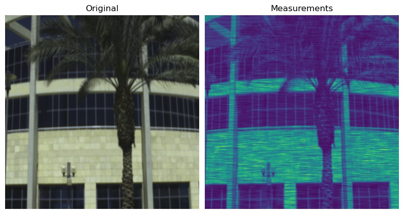
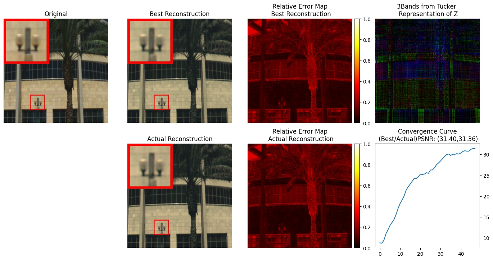

# Compressive Spectral Image Reconstruction using Deep prior and Low-Rank Tensor Representation

[](https://colab.research.google.com/github/hdspgroup/Deep_Prior_Low_Rank/blob/master/colab_setup.ipynb)
[](https://doi.org/10.1364/AO.420305)
[](https://arxiv.org/abs/2101.07424)

## Abstract

Compressive spectral imaging (CSI) has emerged as an alternative spectral image acquisition technology, which reduces the number of measurements at the cost of requiring a recovery process. In general, the reconstruction methods are based on handcrafted priors used as regularizers in optimization algorithms or recent deep neural networks employed as an image generator to learn a non-linear mapping from the low-dimensional compressed measurements to the image space. However, these deep learning methods need many spectral images to obtain good performance. In this work, a deep recovery framework for CSI without training data is presented. The proposed method is based on the fact that the structure of some deep neural networks and an appropriated low-dimensional structure are sufficient to impose a structure of the underlying spectral image from CSI. We analyzed the low-dimensional structure via the Tucker representation, modeled in the first net layer. The proposed scheme is obtained by minimizing the -norm distance between the compressive measurements and the predicted measurements, and the desired recovered spectral image is formed just before the forward operator. Simulated and experimental results verify the effectiveness of the proposed method for the coded aperture snapshot spectral imaging.

## Visual Results

<p align="center">
  
</p>

<p align="center">
  
</p>

## How to cite
If this code is useful for your and you use it in an academic work, please consider citing this paper as


```bib
@article{Bacca:21,
author = {Jorge Bacca and Yesid Fonseca and Henry Arguello},
journal = {Appl. Opt.},
keywords = {Electromagnetic radiation; Image reconstruction; Medical imaging; Neural networks; Spectral imaging; Stochastic gradient descent},
number = {14},
pages = {4197--4207},
publisher = {OSA},
title = {Compressive spectral image reconstruction using deep prior and low-rank tensor representation},
volume = {60},
month = {May},
year = {2021},
url = {http://ao.osa.org/abstract.cfm?URI=ao-60-14-4197},
doi = {10.1364/AO.420305},
abstract = {Compressive spectral imaging (CSI) has emerged as an alternative spectral image acquisition technology, which reduces the number of measurements at the cost of requiring a recovery process. In general, the reconstruction methods are based on handcrafted priors used as regularizers in optimization algorithms or recent deep neural networks employed as an image generator to learn a non-linear mapping from the low-dimensional compressed measurements to the image space. However, these deep learning methods need many spectral images to obtain good performance. In this work, a deep recovery framework for CSI without training data is presented. The proposed method is based on the fact that the structure of some deep neural networks and an appropriated low-dimensional structure are sufficient to impose a structure of the underlying spectral image from CSI. We analyzed the low-dimensional structure via the Tucker representation, modeled in the first net layer. The proposed scheme is obtained by minimizing the \$\{\{\textblackslash\}ell _2\}\$-norm distance between the compressive measurements and the predicted measurements, and the desired recovered spectral image is formed just before the forward operator. Simulated and experimental results verify the effectiveness of the proposed method for the coded aperture snapshot spectral imaging.},
}
```
